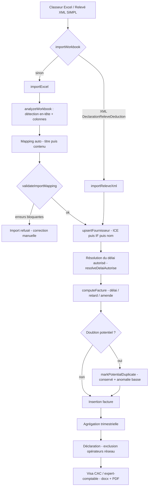
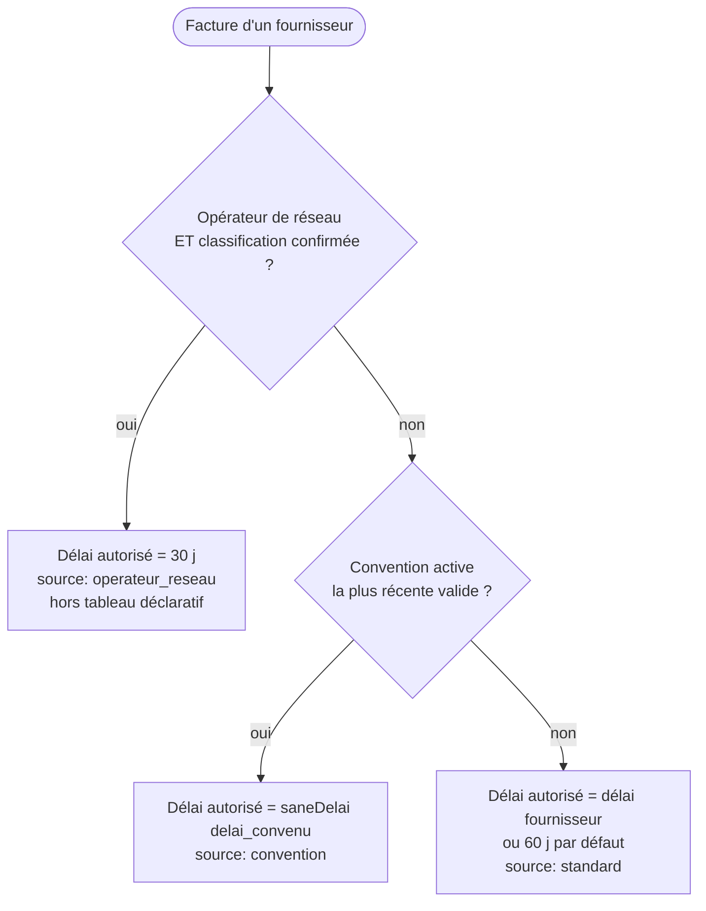
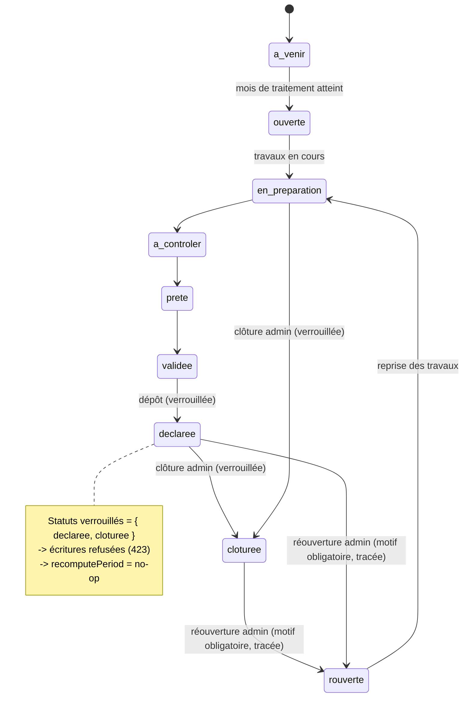

# DelaiPay — Architecture technique

> SaaS de suivi des délais de paiement (loi marocaine **69-21**) pour cabinets d'expertise comptable.
> Cabinet pilote : **HLZ Consulting** — Validatrice métier : **Mme Zahra Hajrioui** — Client de démonstration : **STE CADOZAT SARL**.
>
> Release **1.0** — version applicative `e25ef50ee4` — commit `17ca7ac`.
> Ce document décrit **uniquement** ce qui existe dans le code (`app/src/**`, `app/public/**`).

---

## 1. Vue d'ensemble

DelaiPay est une application web mono-dépôt structurée en deux couches :

| Couche | Technologie | Emplacement |
|--------|-------------|-------------|
| Backend | Node.js + Express | `app/src/**` |
| Base de données | SQLite via le module natif `node:sqlite` (`DatabaseSync`) | fichier `app/data/delaipay.db` |
| Frontend | SPA « vanilla JS » (aucun framework, aucune étape de build) | `app/public/**` |
| Conteneurisation | Docker | `app/Dockerfile` |

Il n'y a **aucun bundler ni transpileur** : les fichiers JS/CSS de `app/public` sont servis tels quels. Le backend est du CommonJS `'use strict'` sans build.

---

## 2. Backend (Express)

### 2.1 Bootstrap — `src/server.js`

- Instancie Express, définit `PORT` (env `PORT`, défaut `3000`).
- `app.set('trust proxy', 1)` : derrière le reverse-proxy nginx, `req.ip` reflète l'IP réelle du client (utile pour l'audit et le rate-limit).
- `app.disable('x-powered-by')` et `app.disable('etag')` (l'ETag n'est géré que par `express.static` pour les assets).
- Middlewares globaux : `securityHeaders` (voir §7), `cookie-parser`, `express.json({ limit: '2mb' })`, `express.urlencoded({ limit: '2mb' })`.
- Démarrage : `ensureSeed()` (module `src/seed`) puis `app.listen`. En cas d'échec de seed, le processus s'arrête (`process.exit(1)`).

### 2.2 Versionnage des assets (cache-busting)

- `buildVersion()` calcule une empreinte **SHA-1 (10 caractères)** du contenu de `js/app.js`, `js/login.js`, `css/app.css`.
- `VERSION = process.env.APP_VERSION || buildVersion()`.
- `renderPage()` injecte `?v=<VERSION>` dans chaque lien d'asset du HTML, une seule fois au démarrage (`PAGES = { app, login }`).
- Les pages HTML sont envoyées avec `Cache-Control: no-store, must-revalidate` ; les assets versionnés (`?v=`) sont `public, max-age=31536000, immutable`, sinon `max-age=60, must-revalidate` (`assetCache`).

### 2.3 Routes de premier niveau

| Route | Rôle |
|-------|------|
| `GET /login` | Page de connexion ; redirige vers `/` si déjà authentifié. |
| `GET /`, `GET /app` | Application (protégée par `pageGuard`). |
| `/api/**` | Routeur API (voir §5). |
| `GET /healthz` | Sonde de santé : `{ ok:true, version, ts }`. |
| `*` (404) | JSON `{ error:'Route inconnue' }` sous `/api`, sinon redirection vers `/`. |

Un **gestionnaire d'erreurs final** journalise l'erreur côté serveur et ne renvoie jamais de trace au client (`{ error:'Erreur serveur' }` / `500`).

### 2.4 Modules `src/*`

| Module | Responsabilité |
|--------|----------------|
| `server.js` | Bootstrap, versionnage assets, pages, santé, gestion d'erreurs. |
| `auth.js` | Authentification JWT (cookie httpOnly), gardes de route. |
| `security.js` | En-têtes de sécurité HTTP (CSP…), limiteur de débit en mémoire. |
| `calc.js` | Moteur de calcul des délais, retards et amendes (loi 69-21). |
| `reseau.js` | Règle « opérateur de réseau » (30 j) et **résolution du délai autorisé**. |
| `periode.js` | Calendrier déclaratif trimestriel, cycle de vie des périodes. |
| `importer.js` | Moteur d'import Excel/XML, mapping, validation, assistant d'import. |
| `db.js` | Connexion SQLite, schéma, migrations idempotentes, `tauxAt`, `audit`, `activeConventionFor`. |
| `visa.js` | Génération du visa (Word `.docx` + PDF) au format officiel. |
| `api.js` | Routeur `/api` (endpoints métier). |
| `seed.js` | Amorçage du compte/données initiales. |
| `util.js` | Utilitaires (`uid`, `normalizeIce`, `normalizeSupplierName`, `fmtMoney`…). |

---

## 3. Base de données (SQLite / `node:sqlite`)

Ouverture dans `src/db.js` : `new DatabaseSync(DB_PATH)` avec `PRAGMA journal_mode = WAL` et `PRAGMA foreign_keys = ON`. Chemin : env `DB_PATH` ou `app/data/delaipay.db` (répertoire créé au démarrage).

Le schéma est créé par des `CREATE TABLE IF NOT EXISTS`, complété par des **migrations additives idempotentes** (`ALTER TABLE … ADD COLUMN` entourés de `try/catch` — sûrs à relancer).

### Tables principales

| Table | Rôle |
|-------|------|
| `cabinet` | Cabinet comptable (locataire). |
| `utilisateur` | Comptes (rôle `admin` / `collaborateur`, `actif`, unicité `(cabinet_id, email)`). |
| `entreprise` | Clients du cabinet. |
| `fournisseur` | Fournisseurs d'un client (+ classification réseau : `operateur_reseau`, `statut_classification`, `delai_special`, `hors_tableau_declaratif`…). |
| `convention` | Conventions de délai (`delai_convenu`, `statut`, `fichier` archivé…). |
| `facture` | Factures + champs calculés dénormalisés (`delai_applicable`, `retard_jours`, `montant_amende`, `couleur_risque`, `statut_doublon`…). |
| `taux_bam` | Historique du taux directeur Bank Al-Maghrib. |
| `declaration` / `ligne_declaration` | Déclaration trimestrielle et ses lignes. |
| `visa` | Visa émis pour une déclaration. |
| `anomalie` | Anomalies détectées (type, gravité, statut, résolution). |
| `document` | Documents archivés (conventions, imports…). |
| `audit_log` | Journal d'audit (voir §9). |
| `periode_declaration` | Cycle de vie des périodes trimestrielles (statut, clôture, réouverture). |
| `import_lot` / `import_ligne` | Traçabilité des imports contrôlés. |
| `modele_mapping` | Modèles de mapping d'import réutilisables. |

Index sur les accès fréquents (`entreprise_id/annee/trimestre`, `cabinet_id`, `fournisseur_id`, `audit_log`…).

Fournisseurs de données transverses exportés par `db.js` :
- `tauxAt(y, m, cabinetId)` : taux BAM en vigueur le 15 du mois (cabinet prioritaire sur global), **défaut `0.0225`**.
- `audit(...)` : insertion dans `audit_log`, **jamais bloquante** (try/catch silencieux).
- `activeConventionFor(entrepriseId, fournisseurId)` : convention `valide` la plus récente (voir Règles métier).

---

## 4. Frontend (SPA vanilla JS)

Fichiers : `app/public/app.html`, `app/public/login.html`, `js/app.js`, `js/login.js`, `css/app.css`.

- **Aucun framework** : DOM manipulé directement en JavaScript.
- **Routage par hash** : la vue courante est dérivée du `location.hash`.
- **État global** (`state`) : notamment `state.period` (période trimestrielle active) et `state.clientId` (entreprise sélectionnée) — c'est cet état qui pilote toutes les requêtes.
- **`perQuery`** : suffixe de requête reconstruit à partir de la période active, ajouté aux appels `/api` afin que **toutes** les vues parlent de la **même** période (cohérence — LOT 5).
- **Assets versionnés** : les liens `css/js` reçoivent `?v=<VERSION>` injecté côté serveur.
- Interactions inline (`onclick=…`) et `<style>` inline — d'où la nécessité de `'unsafe-inline'` dans la CSP (voir §7).

---

## 5. API (`/api`)

Le routeur `src/api.js` est monté sur `/api`. La quasi-totalité des endpoints exige une session valide via `requireAuth` (voir §6), qui attache `req.user` et `req.cabinetId`. Toutes les données sont cloisonnées par cabinet (multi-tenant) et vérifiées par appartenance (`ownedEntreprise` — anti-IDOR).

Familles d'endpoints observées :

- **Clients / entreprises** — CRUD, sélection.
- **Import** — analyse, prévisualisation et confirmation d'un classeur (`analyzeWorkbook`, `previewImport`, `confirmImport`).
- **Factures / périodes** — consultation, recalcul (`recomputePeriod`), agrégats.
- **Conventions** — création avec document archivé (`POST /clients/:id/conventions`).
- **Anomalies** — liste et résolution (`/anomalies/:id/resolve`).
- **Déclaration & visa** — génération de la déclaration trimestrielle, export du visa (PDF `application/pdf`, Word).
- **Périodes** — clôture et réouverture (réservées à l'`admin`).
- **Taux BAM** — mise à jour (réservée à l'`admin`).

Codes de statut métier notables : `401` non authentifié, `403` action réservée admin, `404` ressource non possédée, `409` conflit (réouverture d'une période non clôturée, remplacement de document à confirmer), **`423` Locked** (écriture refusée sur une période verrouillée), `429` rate-limit.

---

## 6. Authentification (JWT en cookie httpOnly) — `src/auth.js`

- **JWT** signé (`jsonwebtoken`) avec un secret chargé par `loadSecret()` : env `JWT_SECRET`, sinon fichier persistant `app/data/.secret` (mode `0600`). En **production**, si aucun secret stable n'est disponible/persistable, le démarrage échoue explicitement (évite d'invalider toutes les sessions à chaque redémarrage).
- Charge utile du token : `{ uid, cid, role, email, nom, ini }`, expiration **12 h**.
- **Cookie** `dp_token` : `httpOnly`, `sameSite: 'lax'`, `path:'/'`, `maxAge` 12 h, `secure` par défaut en production (surchargeable via `COOKIE_SECURE=0/1`).
- Mots de passe : **bcrypt** (`bcryptjs`, 10 tours). `DUMMY_HASH` égalise le temps de réponse quand le compte n'existe pas (anti-énumération par timing).
- Gardes :
  - `requireAuth` (API) : vérifie le token **et** recharge l'utilisateur en base ; refuse si inactif (`401`).
  - `pageGuard` (pages) : redirige vers `/login` si non authentifié.

---

## 7. Sécurité HTTP — `src/security.js`

- **`securityHeaders`** (sans dépendance externe) :
  - **CSP** cloisonnée sur `'self'` : `default-src 'self'`, `frame-ancestors 'none'`, `object-src 'none'`, `img-src`/`font-src` `'self' data:`, `style-src`/`script-src` `'self' 'unsafe-inline'`, `connect-src 'self'`, `form-action 'self'`. `'unsafe-inline'` est requis par les handlers inline et le `<style>` inline du frontend — **aucune origine externe** n'est autorisée.
  - `X-Content-Type-Options: nosniff`, `X-Frame-Options: DENY`, `Referrer-Policy: same-origin`, `Permissions-Policy` (géoloc/micro/caméra/paiement désactivés), `Cross-Origin-Opener-Policy: same-origin`, `X-XSS-Protection: 0`.
  - **HSTS** (`Strict-Transport-Security`) uniquement en production.
- **`rateLimit`** : limiteur en mémoire à fenêtre glissante (défaut 15 min / 30 requêtes), en-têtes `RateLimit-*`, réponse `429` + `Retry-After`. Purge périodique pour éviter la fuite mémoire (utilisé notamment sur le login — anti brute-force).

---

## 8. Docker — `app/Dockerfile`

L'application est conteneurisée (`app/Dockerfile`). Le conteneur exécute le serveur Node (`src/server.js`), qui sert à la fois l'API et les assets statiques ; les données SQLite résident sous `app/data` (montable en volume ; `DB_PATH` configurable). Configuration par variables d'environnement : `PORT`, `APP_VERSION`, `JWT_SECRET`, `COOKIE_SECURE`, `NODE_ENV`, `DB_PATH`, `ADMIN_PASSWORD`.

---

## 9. Audit — table `audit_log`

Chaque action sensible est journalisée via `audit(cabinetId, userId, action, entite, details, ip)` (`src/db.js`). `details` peut être un objet (sérialisé JSON) et porte typiquement l'**état avant/après** (ex. réouverture de période : `{ avant, apres, motif }`). L'écriture d'audit ne casse jamais le flux métier (try/catch). Champs : `action`, `entite`, `details`, `ip`, `created_at`.

---

## 10. Flux métier (import → calcul → déclaration → visa)

1. **Import** : un classeur Excel (ou un relevé de déductions SIMPL au format XML) est analysé (`analyzeWorkbook`), mappé et validé (`validateImportMapping`), prévisualisé (`previewImport`), puis confirmé (`confirmImport`) — création des `fournisseur` et `facture`, détection des doublons potentiels et des anomalies.
2. **Calcul** : `calc.computeFacture` calcule, pour chaque facture, la date limite, le retard, les mois de retard et l'amende, en s'appuyant sur le **délai autorisé résolu** par `reseau.resolveDelaiAutorise` (opérateur réseau 30 j → convention active → 60 j) et sur le taux BAM (`tauxAt`).
3. **Déclaration** : agrégation trimestrielle des factures en retard (les opérateurs de réseau confirmés sont **exclus** du tableau déclaratif via `reseau.estHorsTableauDeclaratif`), production de la `declaration` et de ses `ligne_declaration`.
4. **Visa** : génération du visa officiel (`visa.buildData` → `toDocx` / `toPdf`), CAC ou expert-comptable, conclusion adaptée (sans observation / observation / réserve / refus).
5. **Clôture** : la période est verrouillée ; les valeurs calculées n'évoluent plus (`recomputePeriod` devient un no-op).

### Diagramme — Flux import → calcul → déclaration

### Diagramme — Résolution du délai applicable

### Diagramme — Cycle de vie d'une période

> **Note.** Les statuts `declaree` et `cloturee` constituent l'ensemble **verrouillé** (`STATUTS_VERROUILLES` / `isLocked`). La réouverture (admin) fait repasser la période au statut `rouverte`, seule une période **verrouillée** pouvant être rouverte (sinon `409`).
