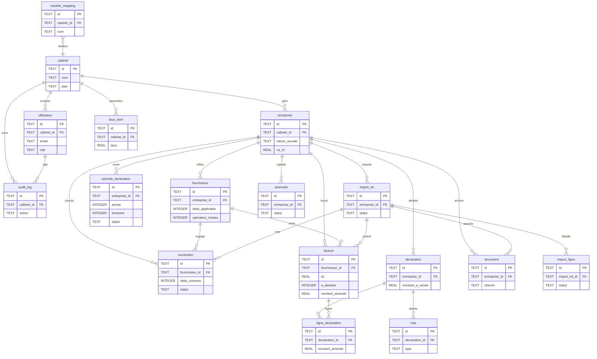

# DelaiPay — Modèle de données (Release 1.0)

Version applicative : `e25ef50ee4` — commit `17ca7ac`.

Ce document décrit le schéma SQLite réellement défini dans `app/src/db.js` et la stratégie de
migration de `app/src/migrate.js`. Aucune table ni colonne n'est inventée.

---

## 1. Moteur et stratégie

- **Moteur** : `node:sqlite` (`DatabaseSync`), le module SQLite **intégré à Node.js ≥ 22.5** —
  **aucun ORM**, aucune dépendance native tierce. Requêtes préparées (`db.prepare(...).get/all/run`).
- **Fichier** : `app/data/delaipay.db` (surchargé par `DB_PATH`). Le dossier `data/` est créé au démarrage.
- **PRAGMA** appliqués à l'ouverture :
  - `PRAGMA journal_mode = WAL;` (write-ahead logging, meilleures lectures concurrentes) ;
  - `PRAGMA foreign_keys = ON;` (les FK sont **logiques** — voir §4 — mais l'enforcement est activé).
- **Clés primaires** : `TEXT` (identifiants applicatifs préfixés générés par `util.uid()`, ex.
  `ent_...`, `four_...`, `conv_...`, `fac_...`, `per_...`, `doc_...`, `log_...`).
- **Dates** : stockées en `TEXT` ISO ; horodatages par défaut via `datetime('now')` (UTC).
- **Isolation multi-tenant** : la quasi-totalité des tables porte `cabinet_id` ; les requêtes de
  l'API filtrent systématiquement dessus.

### 1.1 DDL idempotent au démarrage

`db.js` est le **point unique** de création du schéma et il s'exécute à chaque import du module
(donc à chaque démarrage). La stratégie est **idempotente et sûre à relancer** :

1. **Tables & index** créés via `CREATE TABLE IF NOT EXISTS` / `CREATE INDEX IF NOT EXISTS`.
2. **Ajouts de colonnes** effectués par des `ALTER TABLE ... ADD COLUMN` enveloppés dans
   `try { ... } catch (_) {}` : si la colonne existe déjà, SQLite lève une erreur qui est
   **silencieusement ignorée**. C'est le mécanisme de « migration » incrémentale (pas de table de
   versions ; l'idempotence vient du `IF NOT EXISTS` et des `try/catch`).
3. **Backfill** de données rétro-compatibles (`backfillStatutDoublon()`) : met à jour l'état de
   revue des doublons pour les lignes antérieures à l'ajout de la colonne, sans jamais écraser une
   revue déjà tranchée.

### 1.2 Migration explicite (`migrate.js`)

`node src/migrate.js` (respecte `DB_PATH`) applique une migration **transactionnelle** (`BEGIN` /
`COMMIT` / `ROLLBACK`) qui, à partir des factures existantes :

1. renseigne la **période d'origine** (`annee_origine`, `trimestre_origine`) = trimestre de la
   date de facture ;
2. reconstruit un **`import_lot`** par `import_id` existant (id du lot = `import_id` → idempotent) et
   relie les factures ;
3. crée une **`periode_declaration`** par `(entreprise, annee, trimestre)` réellement présente ;
4. rattache les **anomalies** à leur période via la facture liée ;
5. backfill de l'état `statut_doublon = 'potentiel'`.

La migration est **idempotente** (contrôles d'existence avant insertion), ne supprime ni ne modifie
les montants, et **contrôle l'intégrité** : elle échoue (`exit 1`) si le nombre total de factures
change avant/après.

---

## 2. Tables (17)

> Types SQLite : `TEXT`, `INTEGER`, `REAL`. Les valeurs par défaut indiquées sont celles du DDL.

### 2.1 Cœur métier (bloc principal de `db.js`)

#### `cabinet`
| Colonne | Type | Notes |
|---|---|---|
| `id` | TEXT | **PK** |
| `nom` | TEXT | NOT NULL |
| `slug` | TEXT | |
| `logo` | TEXT | |
| `plan` | TEXT | défaut `'pro'` |
| `created_at` | TEXT | défaut `datetime('now')` |

#### `utilisateur`
| Colonne | Type | Notes |
|---|---|---|
| `id` | TEXT | **PK** |
| `cabinet_id` | TEXT | NOT NULL → `cabinet` |
| `nom` | TEXT | |
| `email` | TEXT | NOT NULL |
| `password_hash` | TEXT | NOT NULL (bcrypt) |
| `role` | TEXT | défaut `'collaborateur'` (`admin` pour actions réservées) |
| `initiales` | TEXT | |
| `titre` | TEXT | |
| `actif` | INTEGER | défaut 1 |
| `created_at` | TEXT | défaut `datetime('now')` |
| **UNIQUE** | | `(cabinet_id, email)` |

#### `entreprise` (client)
| Colonne | Type | Notes |
|---|---|---|
| `id` | TEXT | **PK** |
| `cabinet_id` | TEXT | NOT NULL → `cabinet` |
| `raison_sociale` | TEXT | NOT NULL |
| `ice`, `if_fiscal`, `rc` | TEXT | identifiants |
| `forme_juridique`, `secteur`, `ville`, `adresse` | TEXT | |
| `ca_ht` | REAL | défaut 0 (seuil assujettissement 2 000 000) |
| `exercice_ref` | INTEGER | |
| `email`, `telephone`, `expert_responsable` | TEXT | |
| `created_at` | TEXT | défaut `datetime('now')` |

#### `fournisseur`
| Colonne | Type | Notes |
|---|---|---|
| `id` | TEXT | **PK** |
| `cabinet_id` | TEXT | NOT NULL |
| `entreprise_id` | TEXT | NOT NULL → `entreprise` |
| `raison_sociale`, `ice`, `if_fiscal`, `rc`, `adresse`, `secteur`, `email` | TEXT | |
| `delai_applicable` | INTEGER | défaut 60 |
| `created_at` | TEXT | défaut `datetime('now')` |
| *Colonnes ajoutées (ALTER, règle opérateur réseau)* | | `categorie_fournisseur` TEXT défaut `'standard'`, `operateur_reseau` INTEGER défaut 0, `delai_special` INTEGER, `hors_tableau_declaratif` INTEGER défaut 0, `motif_regle_speciale` TEXT, `classification_source` TEXT, `statut_classification` TEXT, `date_validation` TEXT, `utilisateur_validation` TEXT |

#### `convention`
| Colonne | Type | Notes |
|---|---|---|
| `id` | TEXT | **PK** |
| `cabinet_id` | TEXT | NOT NULL |
| `entreprise_id` | TEXT | NOT NULL → `entreprise` |
| `fournisseur_id` | TEXT | → `fournisseur` (nullable) |
| `objet` | TEXT | |
| `delai_convenu` | INTEGER | défaut 120 |
| `date_signature`, `date_debut`, `date_fin` | TEXT | |
| `statut` | TEXT | défaut `'valide'` (sélection de la convention active) |
| `conforme` | INTEGER | défaut 1 |
| `fichier`, `fichier_nom` | TEXT | pièce jointe archivée (PDF/JPEG/PNG) |
| `created_at` | TEXT | défaut `datetime('now')` |
| *Colonnes ajoutées (ALTER, import Excel)* | | `import_lot_id` TEXT, `reference` TEXT, `commentaire` TEXT, `source_import` TEXT |

#### `facture`
| Colonne | Type | Notes |
|---|---|---|
| `id` | TEXT | **PK** |
| `cabinet_id` | TEXT | NOT NULL |
| `entreprise_id` | TEXT | NOT NULL → `entreprise` |
| `fournisseur_id` | TEXT | → `fournisseur` |
| `numero`, `designation` | TEXT | |
| `mht`, `tva`, `ttc`, `taux_tva` | REAL | montants |
| `mode_reglement` | TEXT | |
| `date_facture`, `date_paiement` | TEXT | |
| `annee`, `periode`, `trimestre` | INTEGER | période **déclarative** |
| `en_litige` | INTEGER | défaut 0 |
| `source_import`, `import_id`, `fichier` | TEXT | origine |
| **Champs calculés (dénormalisés)** | | `delai_applicable` INTEGER, `delai_ecoule` INTEGER, `date_limite` TEXT, `retard_jours` INTEGER, `n_mois` INTEGER, `a_declarer` INTEGER défaut 0, `taux_bam` REAL, `taux_total` REAL, `base_amende` REAL, `montant_amende` REAL, `couleur_risque` TEXT |
| `created_at` | TEXT | défaut `datetime('now')` |
| *Colonnes ajoutées (ALTER, traçabilité)* | | `import_lot_id` TEXT, `annee_origine` INTEGER, `trimestre_origine` INTEGER, `incidence_reportee` INTEGER défaut 0, `facture_origine_id` TEXT |
| *Colonnes ajoutées (ALTER, doublons)* | | `doublon_potentiel` INTEGER défaut 0, `motif_doublon` TEXT, `statut_doublon` TEXT défaut `'aucun'` (`aucun`/`potentiel`/`confirme`/`faux_positif`), `date_revue_doublon` TEXT, `utilisateur_revue_doublon` TEXT |

#### `taux_bam`
| Colonne | Type | Notes |
|---|---|---|
| `id` | TEXT | **PK** |
| `cabinet_id` | TEXT | **nullable** : `NULL` = taux global partagé |
| `taux` | REAL | NOT NULL |
| `date_debut` | TEXT | NOT NULL |
| `date_fin` | TEXT | nullable (taux courant si NULL) |
| `reference` | TEXT | |
| `created_at` | TEXT | défaut `datetime('now')` |

> Résolution (`tauxAt`) : le taux spécifique au cabinet prime sur le taux global ; défaut `0.0225` si aucun.

#### `declaration`
| Colonne | Type | Notes |
|---|---|---|
| `id` | TEXT | **PK** |
| `cabinet_id` | TEXT | NOT NULL |
| `entreprise_id` | TEXT | NOT NULL → `entreprise` |
| `annee`, `trimestre` | INTEGER | |
| `ca_ht` | REAL | |
| `etat_activite` | TEXT | défaut `'normale'` |
| `statut` | TEXT | défaut `'brouillon'` |
| `type_visa` | TEXT | `CAC`/`EC` |
| `montant_total_ttc`, `montant_non_paye`, `montant_paye_hors_delai`, `montant_total_amende`, `montant_litiges`, `sanctions_retard`, `montant_a_verser` | REAL | défaut 0 |
| `nb_lignes` | INTEGER | défaut 0 |
| `date_edition` | TEXT | |
| `created_at` | TEXT | défaut `datetime('now')` |
| **UNIQUE** | | `(entreprise_id, annee, trimestre)` |

#### `ligne_declaration`
| Colonne | Type | Notes |
|---|---|---|
| `id` | TEXT | **PK** |
| `declaration_id` | TEXT | NOT NULL → `declaration` |
| `facture_id` | TEXT | → `facture` |
| `fournisseur_if`, `fournisseur_nom` | TEXT | |
| `ttc`, `non_paye`, `paye_hors_delai`, `montant_amende` | REAL | |
| `retard_jours` | INTEGER | |

#### `visa`
| Colonne | Type | Notes |
|---|---|---|
| `id` | TEXT | **PK** |
| `declaration_id` | TEXT | NOT NULL → `declaration` |
| `type` | TEXT | |
| `montant_vise` | REAL | |
| `conclusion`, `reference`, `signataire`, `lieu`, `date_signature`, `texte` | TEXT | |
| `created_at` | TEXT | défaut `datetime('now')` |

#### `anomalie`
| Colonne | Type | Notes |
|---|---|---|
| `id` | TEXT | **PK** |
| `cabinet_id` | TEXT | NOT NULL |
| `entreprise_id` | TEXT | → `entreprise` |
| `type` | TEXT | ex. `doublon_potentiel`, `date_incoherente`… |
| `gravite` | TEXT | défaut `'moyenne'` |
| `details` | TEXT | |
| `entite`, `entite_id` | TEXT | cible (ex. `facture`) |
| `statut` | TEXT | défaut `'ouverte'` |
| `created_at` | TEXT | défaut `datetime('now')` |
| *Colonnes ajoutées (ALTER)* | | `annee` INTEGER, `trimestre` INTEGER, `import_lot_id` TEXT, `resolue_le` TEXT, `motif_resolution` TEXT |

#### `document`
| Colonne | Type | Notes |
|---|---|---|
| `id` | TEXT | **PK** |
| `cabinet_id` | TEXT | NOT NULL |
| `entreprise_id` | TEXT | → `entreprise` |
| `type`, `nom`, `chemin`, `mime` | TEXT | fichier stocké dans `app/uploads` |
| `taille` | INTEGER | |
| `created_at` | TEXT | défaut `datetime('now')` |
| *Colonnes ajoutées (ALTER)* | | `import_id` TEXT, `nb_factures` INTEGER défaut 0, `annee` INTEGER, `trimestre` INTEGER, `import_lot_id` TEXT, `empreinte` TEXT, `utilisateur_id` TEXT, `statut` TEXT défaut `'traite'` |

#### `audit_log`
| Colonne | Type | Notes |
|---|---|---|
| `id` | TEXT | **PK** |
| `cabinet_id` | TEXT | |
| `user_id` | TEXT | → `utilisateur` |
| `action`, `entite` | TEXT | |
| `details` | TEXT | JSON sérialisé |
| `ip` | TEXT | |
| `created_at` | TEXT | défaut `datetime('now')` |

### 2.2 Périodes & imports contrôlés (2ᵉ bloc de `db.js`)

#### `periode_declaration`
| Colonne | Type | Notes |
|---|---|---|
| `id` | TEXT | **PK** |
| `cabinet_id` | TEXT | NOT NULL |
| `entreprise_id` | TEXT | NOT NULL → `entreprise` |
| `annee`, `trimestre` | INTEGER | NOT NULL |
| `date_debut`, `date_fin` | TEXT | calendrier de la période |
| `mois_traitement`, `annee_traitement` | INTEGER | |
| `statut` | TEXT | défaut `'ouverte'` (`ouverte`/`cloturee`/`declaree`/`rouverte`) |
| `date_cloture`, `cloturee_par`, `date_reouverture`, `motif_reouverture` | TEXT | verrouillage/réouverture |
| `created_at`, `updated_at` | TEXT | défaut `datetime('now')` |
| **UNIQUE** | | `(entreprise_id, annee, trimestre)` |

#### `import_lot`
| Colonne | Type | Notes |
|---|---|---|
| `id` | TEXT | **PK** (= `importId`) |
| `cabinet_id` | TEXT | NOT NULL |
| `entreprise_id` | TEXT | NOT NULL → `entreprise` |
| `document_id` | TEXT | → `document` |
| `annee`, `trimestre` | INTEGER | |
| `source_nom`, `feuille` | TEXT | |
| `ligne_entete` | INTEGER | |
| `mapping_json` | TEXT | |
| `statut` | TEXT | défaut `'confirme'` (`confirme`/`annule`) |
| `nb_lignes_total`, `nb_lignes_valides`, `nb_lignes_ignorees`, `nb_lignes_rejetees`, `nb_doublons` | INTEGER | défaut 0 |
| `total_ttc` | REAL | défaut 0 |
| `empreinte_fichier` | TEXT | SHA-256 |
| `utilisateur_id` | TEXT | → `utilisateur` |
| `created_at`, `confirmed_at`, `cancelled_at` | TEXT | |
| *Colonne ajoutée (ALTER)* | | `source_type` TEXT (ex. `conventions_xlsx` vs factures) |

#### `import_ligne`
| Colonne | Type | Notes |
|---|---|---|
| `id` | TEXT | **PK** |
| `import_lot_id` | TEXT | NOT NULL → `import_lot` |
| `cabinet_id`, `entreprise_id` | TEXT | |
| `numero_ligne` | INTEGER | |
| `feuille` | TEXT | |
| `donnees_brutes_json`, `donnees_normalisees_json` | TEXT | |
| `statut` | TEXT | `valide`/`ignoree`/`rejetee`/`doublon` |
| `motif`, `champ` | TEXT | |
| `facture_id` | TEXT | → `facture` |
| `created_at` | TEXT | défaut `datetime('now')` |

#### `modele_mapping`
| Colonne | Type | Notes |
|---|---|---|
| `id` | TEXT | **PK** |
| `cabinet_id` | TEXT | NOT NULL |
| `nom` | TEXT | NOT NULL |
| `type_fichier`, `signature_colonnes`, `feuille` | TEXT | |
| `ligne_entete` | INTEGER | |
| `mapping_json`, `transformations_json` | TEXT | |
| `created_by` | TEXT | → `utilisateur` |
| `created_at`, `updated_at`, `derniere_utilisation` | TEXT | |

---

## 3. Index

Définis via `CREATE INDEX IF NOT EXISTS` :

| Index | Table (colonnes) |
|---|---|
| `ix_ent_cab` | `entreprise(cabinet_id)` |
| `ix_four_ent` | `fournisseur(entreprise_id)` |
| `ix_fac_ent` | `facture(entreprise_id)` |
| `ix_fac_period` | `facture(entreprise_id, annee, trimestre)` |
| `ix_fac_cab` | `facture(cabinet_id, annee, trimestre)` |
| `ix_fac_four` | `facture(fournisseur_id)` |
| `ix_conv_four` | `convention(fournisseur_id)` |
| `ix_audit_cab` | `audit_log(cabinet_id, created_at)` |
| `ix_perdecl_ent` | `periode_declaration(entreprise_id, annee, trimestre)` |
| `ix_perdecl_cab` | `periode_declaration(cabinet_id, annee, trimestre)` |
| `ix_lot_ent` | `import_lot(entreprise_id, annee, trimestre)` |
| `ix_lot_cab` | `import_lot(cabinet_id, statut)` |
| `ix_ligne_lot` | `import_ligne(import_lot_id, statut)` |
| `ix_fac_lot` | `facture(import_lot_id)` |
| `ix_fac_origine` | `facture(entreprise_id, annee_origine, trimestre_origine)` |
| `ix_doc_ent_per` | `document(entreprise_id, annee, trimestre)` |
| `ix_ano_ent_per` | `anomalie(entreprise_id, annee, trimestre)` |
| `ix_mapping_cab` | `modele_mapping(cabinet_id, type_fichier)` |
| `ix_conv_lot` | `convention(import_lot_id)` |

---

## 4. Relations (FK logiques)

`PRAGMA foreign_keys = ON` est activé, mais les colonnes de liaison sont déclarées comme de simples
`TEXT` **sans clause `REFERENCES`** : les relations sont donc **logiques**, garanties par le code
applicatif (cloisonnement `cabinet_id`, suppressions en cascade côté `api.js`).

- `utilisateur.cabinet_id → cabinet.id`
- `entreprise.cabinet_id → cabinet.id`
- `fournisseur.entreprise_id → entreprise.id` (et `cabinet_id → cabinet.id`)
- `convention.entreprise_id → entreprise.id`, `convention.fournisseur_id → fournisseur.id`, `convention.import_lot_id → import_lot.id`
- `facture.entreprise_id → entreprise.id`, `facture.fournisseur_id → fournisseur.id`, `facture.import_id/import_lot_id → import_lot.id`
- `periode_declaration.entreprise_id → entreprise.id` (unicité `(entreprise, annee, trimestre)`)
- `declaration.entreprise_id → entreprise.id` (unicité `(entreprise, annee, trimestre)`)
- `ligne_declaration.declaration_id → declaration.id`, `ligne_declaration.facture_id → facture.id`
- `visa.declaration_id → declaration.id`
- `anomalie.entreprise_id → entreprise.id`, `anomalie.import_lot_id → import_lot.id`, `anomalie.entite_id → facture.id` (polymorphe via `entite`)
- `document.entreprise_id → entreprise.id`, `document.import_lot_id/import_id → import_lot.id`
- `import_lot.entreprise_id → entreprise.id`, `import_lot.document_id → document.id`
- `import_ligne.import_lot_id → import_lot.id`, `import_ligne.facture_id → facture.id`
- `taux_bam.cabinet_id → cabinet.id` (nullable = taux global)
- `audit_log.cabinet_id → cabinet.id`, `audit_log.user_id → utilisateur.id`

---

## 5. Diagramme entités-relations (tables principales)

---

## 6. Contraintes UNIQUE (récapitulatif)

| Table | Contrainte |
|---|---|
| `utilisateur` | `UNIQUE(cabinet_id, email)` |
| `declaration` | `UNIQUE(entreprise_id, annee, trimestre)` |
| `periode_declaration` | `UNIQUE(entreprise_id, annee, trimestre)` |

Aucune autre contrainte `UNIQUE` n'est déclarée dans le schéma.
</content>
